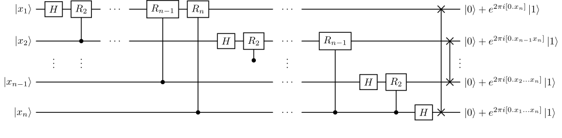

# Noisy quantum computer

With the states and operators defined by this package, we can describe the
execution of a circuit on a noisy quantum computer.

We will run a circuit implementing the quantum Fourier transform on \\(N=5\\)
qubits, as in the following picture.



We will use Hadamard gates and controlled phase gates \\(R_k\\) for \\(k \in
\\{2, \dotsc, N\\}\\). All these gates are already defined in ITensor.  (We
follow the ITensor convention where the first site denotes the control qubit.)

Let's first look how the circuit would be implemented in the noiseless case,
acting on a pure state. We create \\(N\\) sites with the "Qubit" site type, the
initial zero state, then we apply the gates in the required sequence.

```jldoctest nqc; setup = :(using LindbladVectorizedTensors, ITensors, ITensorMPS)
julia> N = 5; s = siteinds("Qubit", N);

julia> ψ = MPS(s, "0");

julia> gate_subseq(k, N) = [
           op("H", s[k]);
           [op("Cphase", s[k+n], s[k]; ϕ=2pi/(2^(n+1))) for n in 1:(N-k)]...
       ];

julia> gate_seq = vcat([gate_subseq(k, N) for k in 1:N]...);

```

Executing the circuit is just a matter of calling `apply` on the MPS with
the list of gates.

```jldoctest nqc; filter = r"id=\d+" => "id=###"
julia> ψₒᵤₜ = apply(gate_seq, ψ)
5-element MPS:
 ((dim=2|id=430|"Qubit,Site,n=1"), (dim=2|id=33|"Link,l=1"))
 ((dim=2|id=174|"Qubit,Site,n=2"), (dim=2|id=33|"Link,l=1"), (dim=4|id=719|"Link,l=2"))
 ((dim=2|id=263|"Qubit,Site,n=3"), (dim=4|id=719|"Link,l=2"), (dim=4|id=80|"Link,l=3"))
 ((dim=2|id=197|"Qubit,Site,n=4"), (dim=4|id=80|"Link,l=3"), (dim=2|id=924|"Link,l=4"))
 ((dim=2|id=705|"Qubit,Site,n=5"), (dim=2|id=924|"Link,l=4"))

```

Let's do the same, but with a density matrix. We will start by running the
noiseless circuit, just to get a feeling of how it can be done.

```jldoctest nqc; filter = r"id=\d+" => "id=###"
julia> s_vec = siteinds("vQubit", N);

julia> ρ = MPS(s_vec, "0");

julia> gate_subseq_vec(k, N) = [
           adjointmap_itensor("H", s_vec[k]);
           [adjointmap_itensor("Cphase", s_vec[k+n], s_vec[k]; ϕ=2pi/(2^(n+1)))
            for n in 1:(N-k)]...
       ];

julia> gate_seq_vec = vcat([gate_subseq_vec(k, N) for k in 1:N]...);

julia> ρₒᵤₜ = apply(gate_seq_vec, ρ)
5-element MPS:
 ((dim=4|id=51|"Site,n=1,vQubit"), (dim=4|id=492|"Link,l=1"))
 ((dim=4|id=479|"Site,n=2,vQubit"), (dim=4|id=492|"Link,l=1"), (dim=16|id=858|"Link,l=2"))
 ((dim=4|id=696|"Site,n=3,vQubit"), (dim=16|id=858|"Link,l=2"), (dim=16|id=302|"Link,l=3"))
 ((dim=4|id=818|"Site,n=4,vQubit"), (dim=16|id=302|"Link,l=3"), (dim=4|id=298|"Link,l=4"))
 ((dim=4|id=720|"Site,n=5,vQubit"), (dim=4|id=298|"Link,l=4"))

```

Since the gates act on the density matrix \\(\rho\\) as \\(X\rho\adj{X}\\), we
have replaced the `op` function in `gate_seq` with `adjointmap_itensor`, a
function defined in this package that returns a tensor representing the
(vectorisation of the) map \\(\rho \mapsto X\rho\adj{X}\\) for a given \\(X\\).

We can check that the two results are the same state by using the
`vec_projector` function, that turns the MPS of a pure state \\(\ket\psi\\) into
the MPS of the vectorisation of \\(\proj\psi\\):

```jldoctest nqc; filter = r"id=\d+" => "id=###"
julia> vec_ψₒᵤₜ = vec_projector(ψₒᵤₜ; existing_sites=siteinds(ρₒᵤₜ))
5-element MPS:
 ((dim=1|id=453|"Link,l=1"), (dim=4|id=51|"Site,n=1,vQubit"))
 ((dim=1|id=973|"Link,l=2"), (dim=1|id=453|"Link,l=1"), (dim=4|id=479|"Site,n=2,vQubit"))
 ((dim=1|id=490|"Link,l=3"), (dim=1|id=973|"Link,l=2"), (dim=4|id=696|"Site,n=3,vQubit"))
 ((dim=1|id=404|"Link,l=4"), (dim=1|id=490|"Link,l=3"), (dim=4|id=818|"Site,n=4,vQubit"))
 ((dim=1|id=404|"Link,l=4"), (dim=4|id=720|"Site,n=5,vQubit"))

julia> vec_ψₒᵤₜ ≈ ρₒᵤₜ
true

```

Let's also check that the trace of the state has actually been preserved, and
that it is still a pure state.
For the trace, we define an appropriate function like in the [GKSL
equation](@ref) example, while the purity is given by the 2-norm of the MPS,
since \\(\tr(\rho^2)\\) corresponds to the inner product of \\(\rho\\) with
itself.
(We cut the imaginary part away since we know that it is supposed to be zero,
but we check it anyway in case something goes wrong.)

```jldoctest nqc
julia> function trace(x::MPS)
           t = dot(MPS(siteinds(x), "Id"), x)
           t ≈ real(t) || @warn "Trace is not real"
           return real(t)
       end;

julia> function purity(x::MPS)
           p = dot(x, x);
           p ≈ real(p) || @warn "Purity is not real"
           return real(p)
       end;

julia> trace(ρₒᵤₜ) ≈ 1
true

julia> purity(ρₒᵤₜ) ≈ 1
true

```

Now we add a depolarising noise channel after each gate, acting locally on the
qubits affected by the gate.  We use its Kraus decomposition

```math
\begin{gather*}
    D_\lambda(\rho) =
    \sum_{i=0}^{3} K_i\phantomadj \rho \adj{K_i},\\
    K_0 = \sqrt{1-\frac{3\lambda}{4}} \imat[2],\quad
    K_1 = \sqrt{\frac{\lambda}{4}} \sigma_x,\quad
    K_2 = \sqrt{\frac{\lambda}{4}} \sigma_y,\quad
    K_3 = \sqrt{\frac{\lambda}{4}} \sigma_z.
\end{gather*}
```

and arbitrarily choose \\(\lambda=0.05\\).

```jldoctest nqc
julia> function depolarising_ch(λ, s::Index)
           @assert 0 ≤ λ ≤ 1 + 1/3
           return (1 - 3λ/4) * op("Id", s) +
                  λ/4 * adjointmap_itensor("X", s) +
                  λ/4 * adjointmap_itensor("Y", s) +
                  λ/4 * adjointmap_itensor("Z", s)
       end;

julia> noise = [reduce(*, depolarising_ch(0.05, si) for si in gate_sites)
                for gate_sites in inds.(gate_seq_vec; tags="Site", plev=0)];

```

We built the `noise` list by getting the site indices of each gate
(`gate_sites`) and then taking the product of a depolarising channel on each of
those sites.

We now combine the `gate_seq_vec` and the `noise` operators, alternating them:

```jldoctest nqc; filter = r"id=\d+" => "id=###"
julia> gate_seq_vec_noisy = collect(Iterators.flatten(zip(gate_seq_vec, noise)));

julia> ρₒᵤₜ_noisy = apply(gate_seq_vec_noisy, ρ)
5-element MPS:
 ((dim=4|id=51|"Site,n=1,vQubit"), (dim=4|id=492|"Link,l=1"))
 ((dim=4|id=479|"Site,n=2,vQubit"), (dim=4|id=492|"Link,l=1"), (dim=16|id=858|"Link,l=2"))
 ((dim=4|id=696|"Site,n=3,vQubit"), (dim=16|id=858|"Link,l=2"), (dim=16|id=302|"Link,l=3"))
 ((dim=4|id=818|"Site,n=4,vQubit"), (dim=16|id=302|"Link,l=3"), (dim=4|id=298|"Link,l=4"))
 ((dim=4|id=720|"Site,n=5,vQubit"), (dim=4|id=298|"Link,l=4"))

```

Now the purity of the state has decreased, as a consequence of the noise, while
its trace is still, of course, 1.

```jldoctest nqc; filter = r"0.3205388\d+" => "0.3205388###"
julia> trace(ρₒᵤₜ_noisy) ≈ 1
true

julia> purity(ρₒᵤₜ_noisy)
0.32053886090015327

```
