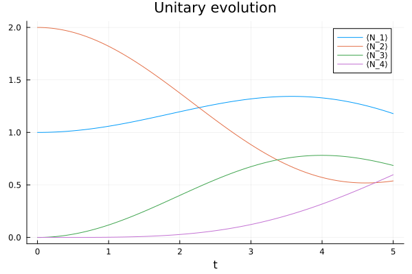

# Examples

In this section we will see two possible uses of this library: define the terms
of a GKSL equation to use in a MPS-based time-evolution algorithm, and build the
channels describing the execution of a noisy quantum circuit.
 
## GKSL equation

With the states and operators defined by this package, we can define a Lindbladian
operator acting on density matrices, in a typical GKSL equation.
Let's take, as an example, a system of \(N=4\) harmonic oscillators described by the
Hamiltonian

```math
H=
\sum_{n=1}^{N} \omega_n\phantomadj a^\dagger_n a_n\phantomadj + 
\sum_{n=1}^{N-1} \lambda_n\phantomadj (a^\dagger_n a_{n+1}\phantomadj + a^\dagger_{n+1}
a_n\phantomadj).
```

We set up the site indices and the coefficients (to some arbitrary values),

```jldoctest gkslexample; setup = :(using LindbladVectorizedTensors, ITensors, ITensorMPS)
julia> N = 4; s = siteinds("vBoson", N; dim=5);

julia> ω = fill(1.0, N);

julia> λ = fill(0.25, N);

```

and the initial state such that there's one particle in the first site and two
in the second one:

```jldoctest gkslexample; filter = r"id=\d+" => "id=#"
julia> ρₜ = MPS(s, ["1", "2", "0", "0"])
4-element MPS:
 ((dim=25|id=644|"Site,n=1,vBoson"), (dim=1|id=769|"Link,l=1"))
 ((dim=1|id=769|"Link,l=1"), (dim=25|id=431|"Site,n=2,vBoson"), (dim=1|id=427|"Link,l=2"))
 ((dim=1|id=427|"Link,l=2"), (dim=25|id=652|"Site,n=3,vBoson"), (dim=1|id=382|"Link,l=3"))
 ((dim=1|id=382|"Link,l=3"), (dim=25|id=551|"Site,n=4,vBoson"))

```

We will evolve the state using the tMPS algorithm, where we break up the
evolution operator \\(\exp(-\iu tH)\\) into smaller factors using a quite
rudimental Suzuki-Trotter approximation
 
```math
\exp(-\iu tH) \approx \exp(-\iu tH_{34}) \exp(-\iu tH_{23}) \exp(-\iu tH_{12})
```

where

```math
\begin{gather*}
H_{12} \defeq
\omega_1\phantomadj \adj{a_1} a_1\phantomadj + 
\lambda_1 (\adj{a_1} a_2\phantomadj + \adj{a_2} a_1\phantomadj) +
\tfrac12 \omega_2\phantomadj \adj{a_2} a_2\phantomadj,\\
H_{23} \defeq
\tfrac12 \omega_2\phantomadj \adj{a_2} a_2\phantomadj +
\lambda_2 (\adj{a_2} a_3\phantomadj + \adj{a_3} a_2\phantomadj) +
\tfrac12 \omega_3\phantomadj \adj{a_3} a_3\phantomadj,\\
H_{34} \defeq
\tfrac12 \omega_3\phantomadj \adj{a_3} a_3\phantomadj +
\lambda_3 (\adj{a_3} a_4\phantomadj + \adj{a_4} a_3\phantomadj) +
\omega_4\phantomadj \adj{a_4} a_4\phantomadj.
\end{gather*}
```

This decomposition implies a similar decomposition for the commutators, that is

```math
\exp(-\iu t [H, \blank]) \approx
\exp(-\iu t [H_{34}, \blank])
\exp(-\iu t [H_{23}, \blank])
\exp(-\iu t [H_{12}, \blank])
```

so we can compose the time-evolution operator for our mixed state as follows:

```jldoctest gkslexample
julia> L₁₂ = (
           ω[1] * gkslcommutator_itensor(s, "N", 1, "Id", 2) +
           λ[1] * (
               gkslcommutator_itensor(s, "Adag", 1, "A", 2) +
               gkslcommutator_itensor(s, "A", 1, "Adag", 2)
           ) +
           0.5ω[2] * gkslcommutator_itensor(s, "Id", 1, "N", 2)
       );

julia> L₂₃ = (
           0.5ω[2] * gkslcommutator_itensor(s, "N", 2, "Id", 3) +
           λ[2] * (
               gkslcommutator_itensor(s, "Adag", 2, "A", 3) +
               gkslcommutator_itensor(s, "A", 2, "Adag", 3)
           ) +
           0.5ω[3] * gkslcommutator_itensor(s, "Id", 2, "N", 3)
       );

julia> L₃₄ = (
           0.5ω[3] * gkslcommutator_itensor(s, "N", 3, "Id", 4) +
           λ[3] * (
               gkslcommutator_itensor(s, "Adag", 3, "A", 4) +
               gkslcommutator_itensor(s, "A", 3, "Adag", 4)
           ) +
           ω[4] * gkslcommutator_itensor(s, "Id", 3, "N", 4)
       );

julia> L = [L₁₂, L₂₃, L₃₄];

```

Now we evolve the state, and at each time step we record its trace and the
expectation value (normalised by the trace) of the number operator on all sites.
Let's define first some functions to compute the expectation values.

```jldoctest gkslexample
julia> function expect_vec(x::MPS, name::AbstractString)
           return [dot(MPS(siteinds(x), j -> j == n ? name : "Id"), x)
                   for n in 1:length(x)]
       end;

julia> trace(x::MPS) = dot(MPS(siteinds(x), "Id"), x);

```

We will store the results in the columns of a matrix: the i-th column will be
\\(\tr(N^{(i)} \rho\sb{t})\\), while the last will be \\(\tr\rho\sb{t}\\).
We use the decomposition

```math
\Phi_t \approx
\exp(\tfrac{t}{2} L_{12})
\exp(\tfrac{t}{2} L_{23})
\exp(\tfrac{t}{2} L_{34})
\exp(\tfrac{t}{2} L_{34})
\exp(\tfrac{t}{2} L_{23})
\exp(\tfrac{t}{2} L_{12})
```

as our time-evolution operator for a time increment \\(t\\).

```jldoctest gkslexample
julia> dt = 0.05; tmax=5;
 
julia> evol_seq = exp.(0.5dt .* L); append!(evol_seq, reverse(evol_seq));

julia> nsteps = floor(Int, tmax / dt);

julia> expvals = Matrix{Float64}(undef, nsteps+1, N+1);

```

```jldoctest gkslexample
julia> tr_ρₜ = trace(ρₜ); expvals[1,:] = [expect_vec(ρₜ, "N") ./ tr_ρₜ; tr_ρₜ];

julia> expvals[1,:] ≈ [1, 2, 0, 0, 1]
true

julia> for step in 1:nsteps
           ρₜ = apply(evol_seq, ρₜ)
           tr_ρₜ = trace(ρₜ)
           expvals[step+1,:] .= [expect_vec(ρₜ, "N") ./ tr_ρₜ; tr_ρₜ]
       end

```

Let's visualise the results using the Plots library:

```jldoctest gkslexample
julia> using Plots

julia> plt = plot(; title="Unitary evolution", xlabel="t");

julia> for n in 1:N
           plot!(plt, 0:dt:tmax, expvals[:,n], label="⟨N_$n⟩")
       end;

```



## Noisy quantum circuit

_(coming soon...)_
